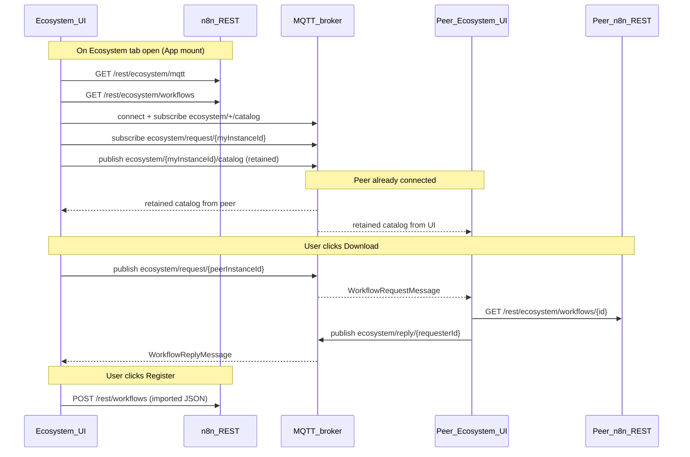

# AGENTS.md

Developer notes for the n8n-hooks-marketplace codebase.

## Repository layout

```
src/
  shared/          # SKILL parser, catalog extraction, MQTT topic helpers/types
  backend/hooks.ts # n8n external hook (REST + static assets)
  bridge/index.ts  # Injects Ecosystem tab + iframe into n8n editor
  app/             # React Ecosystem UI (Vite)
dist/              # Build output (backend CJS, bridge IIFE, Vite app)
test/
  e2e/             # Real e2e: aedes MQTT, dual n8n, Playwright
  fixtures/        # Workflow fixtures for e2e
scripts/
  dev.ts           # Dev orchestrator (Vite + n8n, cleans up on Ctrl+C)
  dev-n8n.ts       # n8n + embedded MQTT broker for local dev
```

## Build

```bash
npm install
npm run build
```

Outputs:

| Artifact | Path |
| --- | --- |
| Backend hook (CJS) | `dist/backend/hooks.cjs` |
| Bridge (IIFE) | `dist/bridge/index.js` |
| Ecosystem app | `dist/app/` |

## Local development

```bash
npm run dev
```

Starts Vite (HMR), an embedded MQTT broker (WebSocket), and n8n with hooks wired. Ctrl+C tears down both process trees.

| Service | URL |
| --- | --- |
| n8n editor | http://127.0.0.1:5678 |
| Ecosystem app (Vite) | http://localhost:5173/rest/ecosystem/app/ |
| Default login | `dev@example.com` / `DevPassword123!` |

Dev state: `.dev/n8n/` (gitignored). Override login with `N8N_DEV_EMAIL` / `N8N_DEV_PASSWORD`.

To use an external broker instead of the embedded one, set `MQTT_BROKER_URL` before `npm run dev`.

## Environment variables

| Variable | Purpose |
| --- | --- |
| `EXTERNAL_HOOK_FILES` | Absolute path to `dist/backend/hooks.cjs` |
| `EXTERNAL_FRONTEND_HOOKS_URLS` | URL(s) to `bridge.js` on this n8n instance (`;`-separated) |
| `MQTT_BROKER_URL` | WebSocket MQTT broker URL for the Ecosystem UI (`ws://` / `wss://`) |
| `ECOSYSTEM_APP_URL` | Optional Vite dev server URL for the iframe (omit in production) |
| `N8N_SECURE_COOKIE` | Set `false` for local HTTP testing |
| `N8N_PORT` | n8n listen port (default `5678`; used by Vite proxy in dev) |

## Backend REST routes

Registered on `n8n.ready` under `/{restEndpoint}/ecosystem/`:

| Route | Purpose |
| --- | --- |
| `GET /mqtt` | Returns `{ url }` from `MQTT_BROKER_URL` |
| `GET /config` | Returns `{ mode, appUrl }` for bridge iframe |
| `GET /bridge.js` | Serves bridge bundle |
| `GET /workflows` | Lists local shareable workflows (SKILL sticky note) |
| `GET /workflows/:id` | Full workflow JSON for a shareable workflow |
| `GET /app/*` | Serves built React app (or Vite URL in dev via `ECOSYSTEM_APP_URL`) |

Shareable detection: scan workflow `nodes` for `type === 'n8n-nodes-base.stickyNote'`, parse `parameters.content` as SKILL.md frontmatter. Require `name` + `description`; optional `metadata.author`, `metadata.version`, `metadata.tags`.

## Bridge

`src/bridge/index.ts` is loaded via `EXTERNAL_FRONTEND_HOOKS_URLS`. On `app.mount` / `nodeView.mount` / `main.routeChange`:

1. Fetches `/rest/ecosystem/config` for iframe URL
2. Injects an **Ecosystem** tab after Evaluations in the n8n radio tab bar
3. On click, shows an iframe panel inside `main` (below the tab bar, same region as Editor/Executions/Evaluations content)
4. Clicking Editor / Executions / Evaluations hides the Ecosystem panel

## React app

`src/app/` connects to MQTT on mount, publishes the local catalog, subscribes to peer catalogs, and provides search/filter/download/register UI.

- **Download**: MQTT request/reply to fetch full workflow JSON from peer
- **Register**: `POST /rest/workflows` on the local n8n instance with the downloaded JSON

Instance identity is stored in `localStorage` (`ecosystem-instance-id`, `ecosystem-instance-name`).

## MQTT protocol

All marketplace traffic runs in the **browser** via MQTT.js. The backend only exposes the broker URL; it does not publish or subscribe.

Peers must share one broker. Payloads are JSON UTF-8.

### Topics

| Topic | Pattern | Retain | Direction |
| --- | --- | --- | --- |
| Catalog | `ecosystem/{instanceId}/catalog` | yes | Each instance publishes its own catalog |
| Catalog subscribe | `ecosystem/+/catalog` | — | Every instance subscribes |
| Workflow request | `ecosystem/request/{targetInstanceId}` | no | Requester → owner |
| Workflow reply | `ecosystem/reply/{requesterId}` | no | Owner → requester |

`instanceId` and `requesterId` are UUIDs from the browser's `localStorage` (`ecosystem-instance-id`).

### Message types

**CatalogMessage** (published to `ecosystem/{instanceId}/catalog`):

```json
{
  "instanceId": "uuid",
  "instanceName": "n8n-abc12345",
  "entries": [
    {
      "instanceId": "uuid",
      "instanceName": "n8n-abc12345",
      "workflowId": "n8n-workflow-id",
      "workflowName": "My Workflow",
      "skill": {
        "name": "my-skill",
        "description": "...",
        "metadata": { "author": "...", "version": "1.0", "tags": ["demo"] }
      },
      "publishedAt": "2026-01-01T00:00:00.000Z"
    }
  ]
}
```

**WorkflowRequestMessage** (published to `ecosystem/request/{targetInstanceId}`):

```json
{
  "requesterId": "uuid",
  "workflowId": "n8n-workflow-id",
  "replyTopic": "ecosystem/reply/{requesterId}"
}
```

**WorkflowReplyMessage** (published to `ecosystem/reply/{requesterId}`):

```json
{
  "workflowId": "n8n-workflow-id",
  "workflow": { "name": "...", "nodes": [], "connections": {}, "settings": {} }
}
```

### Lifecycle (when messages are sent and received)



| Event | Subscribe | Publish |
| --- | --- | --- |
| App mount / MQTT connect | `ecosystem/+/catalog`, `ecosystem/request/{myInstanceId}` | `ecosystem/{myInstanceId}/catalog` (retained) |
| Incoming catalog (peer) | — | — (UI updates peer list; ignores own `instanceId`) |
| Incoming workflow request (owner) | — | `ecosystem/reply/{requesterId}` after `GET /rest/ecosystem/workflows/:id` |
| User download (requester) | `ecosystem/reply/{myInstanceId}` (per request) | `ecosystem/request/{targetInstanceId}` |
| User register | — | — (local REST only) |

Catalog entries are built from `GET /rest/ecosystem/workflows` on the owning instance. Full workflow JSON is never put on MQTT except in the reply to a explicit download request.

## Tests

```bash
npm test          # unit tests (vitest)
npm run test:e2e  # real e2e: Vitest + Playwright, aedes + triple n8n
npm run test:e2e:cleanup  # kill orphaned n8n from interrupted e2e runs
```

E2e is driven by Vitest (`test/e2e/marketplace.test.ts`) with Playwright in the browser. `test/e2e/run-e2e.ts` boots one MQTT broker and three n8n instances, runs Vitest in-process (same Node process as the harness), then tears everything down. Individual UI waits cap at 15s (`test/e2e/constants.ts`); harness boot caps at 60s; the full Vitest run caps at 75s.

Tests cover discovery, fuzzy search, author/tag filters, download, and register in one consolidated case.

- `test/e2e/screenshots/ecosystem-a.png`
- `test/e2e/screenshots/ecosystem-b.png`
- `test/e2e/screenshots/ecosystem-c.png`

## Lint / format

```bash
npm run lint
npm run format
```
