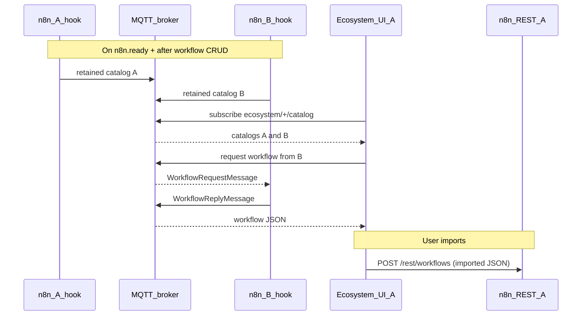

# AGENTS.md

Developer notes for the n8n-hooks-marketplace codebase.

## Repository layout

```
src/
  shared/          # SKILL parser, catalog extraction, MQTT topic helpers/types
  backend/hooks.ts # n8n external hook (REST + MQTT catalog/replies)
  backend/ecosystem-mqtt.ts # Backend MQTT client for catalog publish and workflow replies
  bridge/index.ts  # Injects Ecosystem tab + iframe into n8n editor
  app/             # React Ecosystem UI (Vite)
dist/              # Build output (backend CJS, bridge IIFE, Vite app)
test/
  e2e/             # Real e2e: aedes MQTT, dual n8n, Playwright
  fixtures/        # Workflow fixtures for e2e
scripts/
  dev.ts           # Dev orchestrator (Vite + n8n, cleans up on Ctrl+C)
  dev-n8n.ts       # n8n + embedded MQTT broker for local dev
```

## Build

```bash
npm install
npm run build
```

Outputs:

| Artifact | Path |
| --- | --- |
| Backend hook (CJS) | `dist/backend/hooks.cjs` |
| Bridge (IIFE) | `dist/bridge/index.js` |
| Ecosystem app | `dist/app/` |

## Local development

```bash
npm run dev
```

Starts Vite (HMR), an embedded MQTT broker (WebSocket), and n8n with hooks wired. Ctrl+C tears down both process trees.

| Service | URL |
| --- | --- |
| n8n editor | http://127.0.0.1:5678 |
| Ecosystem app (Vite) | http://localhost:5173/rest/ecosystem/app/ |
| Default login | `dev@example.com` / `DevPassword123!` |

Dev state: `.dev/n8n/` (gitignored). Override login with `N8N_DEV_EMAIL` / `N8N_DEV_PASSWORD`.

To use an external broker instead of the embedded one, set `MQTT_BROKER_URL` before `npm run dev`.

## Environment variables

| Variable | Purpose |
| --- | --- |
| `EXTERNAL_HOOK_FILES` | Absolute path to `dist/backend/hooks.cjs` |
| `EXTERNAL_FRONTEND_HOOKS_URLS` | URL(s) to `bridge.js` on this n8n instance (`;`-separated) |
| `MQTT_BROKER_URL` | WebSocket MQTT broker URL (`ws://` / `wss://`) |
| `ECOSYSTEM_INSTANCE_ID` | Stable UUID for this n8n instance (catalog + request routing) |
| `ECOSYSTEM_INSTANCE_NAME` | Human-readable instance name shown in the Ecosystem UI |
| `ECOSYSTEM_APP_URL` | Optional Vite dev server URL for the iframe (omit in production) |
| `N8N_SECURE_COOKIE` | Set `false` for local HTTP testing |
| `N8N_PORT` | n8n listen port (default `5678`; used by Vite proxy in dev) |

## Backend REST routes

Registered on `n8n.ready` under `/{restEndpoint}/ecosystem/`:

| Route | Purpose |
| --- | --- |
| `GET /mqtt` | Returns `{ url }` from `MQTT_BROKER_URL` |
| `GET /config` | Returns `{ mode, appUrl, stylesheets, instanceId, instanceName }` for bridge iframe and app styling |
| `GET /bridge.js` | Serves bridge bundle |
| `GET /workflows` | Lists local shareable workflows (SKILL sticky note) |
| `GET /workflows/:id` | Full workflow JSON for a shareable workflow |
| `GET /app/*` | Serves built React app (or Vite URL in dev via `ECOSYSTEM_APP_URL`) |

Shareable detection: scan workflow `nodes` for `type === 'n8n-nodes-base.stickyNote'`, parse `parameters.content` as SKILL.md frontmatter. Require `name` + `description`; optional `metadata.author`, `metadata.version`, `metadata.tags`.

`GET /config` includes `stylesheets`: root-relative URLs parsed from `n8n-editor-ui/dist/index.html` (`link[rel="stylesheet"]`, `{{BASE_PATH}}` stripped). Missing package or HTML is a 500 — no fallbacks.

## Bridge

`src/bridge/index.ts` is loaded via `EXTERNAL_FRONTEND_HOOKS_URLS`. On `app.mount` / `nodeView.mount` / `main.routeChange`:

1. Fetches `/rest/ecosystem/config` for iframe URL
2. Injects an **Ecosystem** tab after Evaluations in the n8n radio tab bar
3. On click, shows an iframe panel inside `main` (below the tab bar, same region as Editor/Executions/Evaluations content)
4. Clicking Editor / Executions / Evaluations hides the Ecosystem panel

## React app

`src/app/` connects to MQTT on mount, subscribes to peer catalogs, and provides search/filter UI with per-entry actions. The backend hook publishes this instance's catalog and answers workflow requests.

On boot, fetches `/rest/ecosystem/config` and injects each `stylesheets` URL as `<link rel="stylesheet">` in the iframe head. Layout and control styles live in `src/app/styles.css` (`.ecosystem__input`, `.ecosystem__button`) using n8n design tokens from those stylesheets.

- **Hide Own Workflows** (default off): when checked, hides local catalog entries and shows peers only
- **Copy to Clipboard**: fetch workflow JSON (local REST or MQTT request/reply), then `navigator.clipboard.writeText`
- **Import into N8N**: fetch if needed, then `POST /rest/workflows` (disabled for own-instance entries)
- **Download Workflow**: fetch if needed, then trigger a `.json` file download via Blob + `<a download>`

Workflow fetch uses a 15s timeout. Own workflows resolve via `GET /rest/ecosystem/workflows/:id`; peers use MQTT request/reply to the owning backend. Per-action errors render at `data-ecosystem-action-error`.

Instance identity comes from `/rest/ecosystem/config` (`ECOSYSTEM_INSTANCE_ID` / `ECOSYSTEM_INSTANCE_NAME`). The header shows the instance ID at `data-ecosystem-instance-id`. The browser keeps a `requesterId` in `localStorage` (`ecosystem-requester-id`) for MQTT reply routing.

The visible catalog list is sorted alphabetically by `skill.name` when no search query is active.

## MQTT protocol

The backend hook connects to `MQTT_BROKER_URL` on `n8n.ready`, publishes a retained catalog, subscribes to workflow requests, and republishes on `workflow.afterCreate` / `afterUpdate` / `afterDelete`. The browser connects via MQTT.js to discover catalogs and request peer workflows.

Peers must share one broker. Payloads are JSON UTF-8.

### Topics

| Topic | Pattern | Retain | Direction |
| --- | --- | --- | --- |
| Catalog | `ecosystem/{instanceId}/catalog` | yes | Backend publishes its own catalog |
| Catalog subscribe | `ecosystem/+/catalog` | — | Browser subscribes |
| Workflow request | `ecosystem/request/{targetInstanceId}` | no | Browser requester → owner backend |
| Workflow reply | `ecosystem/reply/{requesterId}` | no | Owner backend → browser requester |

`instanceId` is `ECOSYSTEM_INSTANCE_ID`. `requesterId` is a UUID in the browser's `localStorage` (`ecosystem-requester-id`).

### Message types

**CatalogMessage** (published to `ecosystem/{instanceId}/catalog`):

```json
{
  "instanceId": "uuid",
  "instanceName": "n8n-abc12345",
  "entries": [
    {
      "instanceId": "uuid",
      "instanceName": "n8n-abc12345",
      "workflowId": "n8n-workflow-id",
      "workflowName": "My Workflow",
      "skill": {
        "name": "my-skill",
        "description": "...",
        "metadata": { "author": "...", "version": "1.0", "tags": ["demo"] }
      },
      "publishedAt": "2026-01-01T00:00:00.000Z"
    }
  ]
}
```

**WorkflowRequestMessage** (published to `ecosystem/request/{targetInstanceId}`):

```json
{
  "requesterId": "uuid",
  "workflowId": "n8n-workflow-id",
  "replyTopic": "ecosystem/reply/{requesterId}"
}
```

**WorkflowReplyMessage** (published to `ecosystem/reply/{requesterId}`):

```json
{
  "workflowId": "n8n-workflow-id",
  "workflow": { "name": "...", "nodes": [], "connections": {}, "settings": {} }
}
```

### Lifecycle (when messages are sent and received)



| Event | Backend subscribe | Backend publish | Browser subscribe | Browser publish |
| --- | --- | --- | --- | --- |
| `n8n.ready` / workflow CRUD | `ecosystem/request/{instanceId}` | `ecosystem/{instanceId}/catalog` (retained) | — | — |
| App mount | — | — | `ecosystem/+/catalog` | — |
| Incoming workflow request | — | `ecosystem/reply/{requesterId}` | — | — |
| User copy / import / download | — | — | `ecosystem/reply/{requesterId}` (per request) | `ecosystem/request/{targetInstanceId}` |
| User import | — | — | — | — (local REST only) |

Catalog entries are built from the owning instance's workflow DB. Full workflow JSON is never put on MQTT except in the reply to an explicit download request.

## Tests

```bash
npm test          # unit tests (vitest)
npm run test:e2e  # real e2e: Vitest + Playwright, aedes + triple n8n
npm run test:e2e:cleanup  # kill orphaned n8n from interrupted e2e runs
npm run dev:e2e   # harness only: triple n8n + MQTT for manual UI review (Ctrl+C to stop)
```

E2e is driven by Vitest (`test/e2e/marketplace.test.ts`) with Playwright in the browser. `test/e2e/run-e2e.ts` boots one MQTT broker and three n8n instances, runs Vitest in-process (same Node process as the harness), then tears everything down. Individual UI waits cap at 15s (`test/e2e/constants.ts`); harness boot caps at 60s; the full Vitest run caps at 100s.

Tests cover instance ID, hide-own toggle, backend-published peer discovery from a single tab, alphabetical catalog order, fuzzy search, author/tag filters, copy, import, file download, and own-import disabled in one consolidated case.

- `test/e2e/screenshots/ecosystem-a-own.png`
- `test/e2e/screenshots/ecosystem-b-own.png`
- `test/e2e/screenshots/ecosystem-c-own.png`
- `test/e2e/screenshots/ecosystem-a-peers.png`
- `test/e2e/screenshots/ecosystem-b-peers.png`
- `test/e2e/screenshots/ecosystem-c-peers.png`

## Lint / format

```bash
npm run lint
npm run format
```
