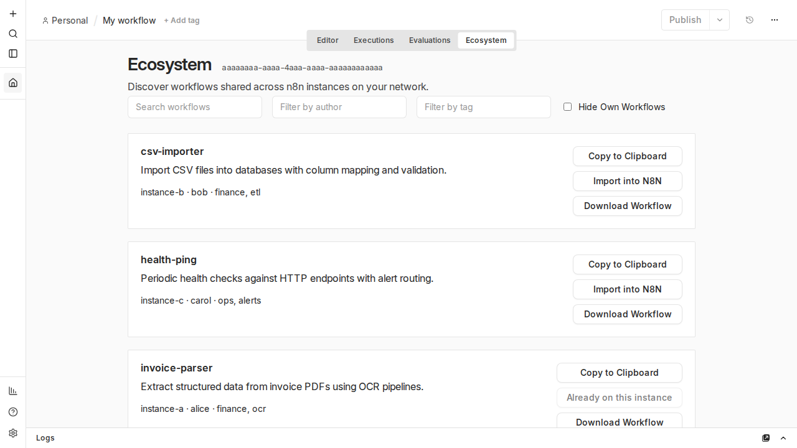
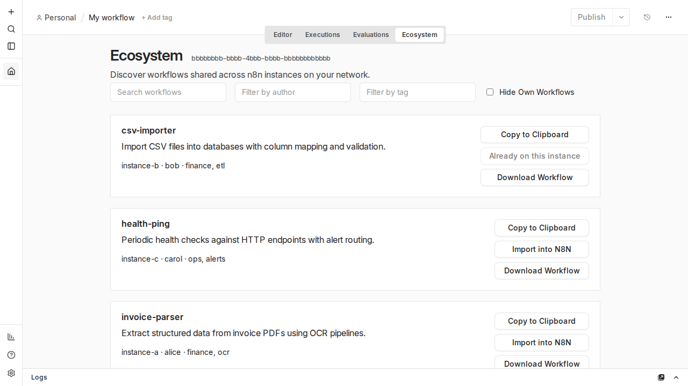
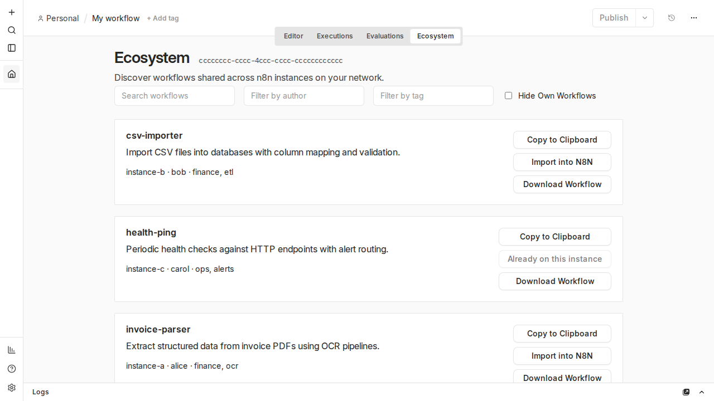
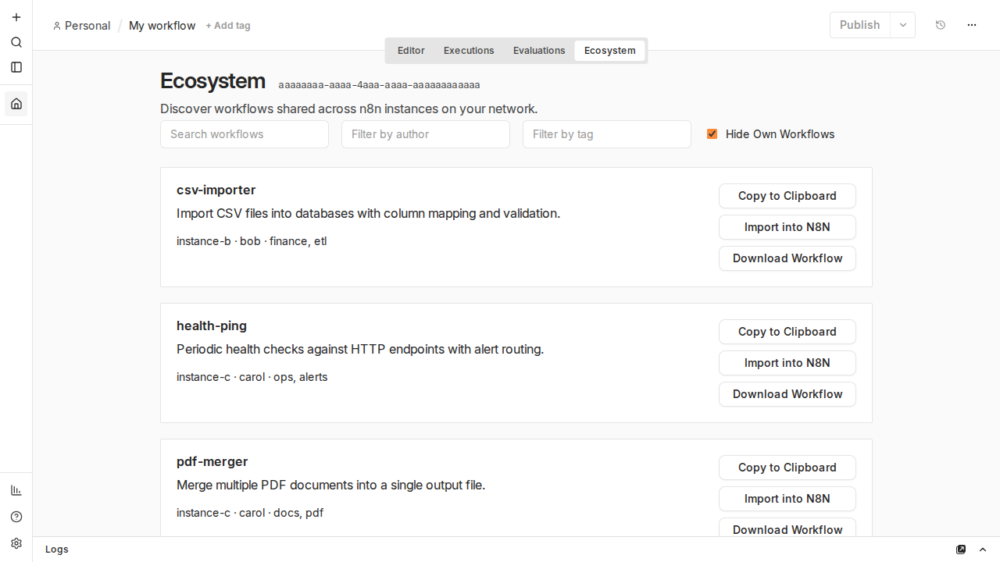
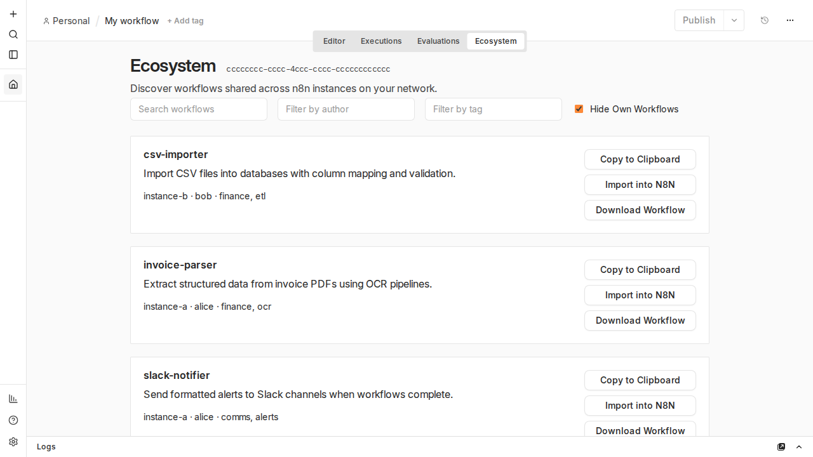

# n8n-hooks-marketplace

Decentralized Workflow Marketplace for N8N Self Hosted Instances over MQTT

## Synopsis

This repository offers a decentralized marketplace that connects multiple self hosted N8N instances together and allows them to communicate with each other over a local network and through an MQTT server.

This marketplace enables Workflow discoverability and sharing within a closed network.

## Architecture

The marketplace itself is integrated into N8N through frontend and backend [Hooks](https://docs.n8n.io/deploy/host-n8n/configure-n8n/external-hooks#frontend-external-hooks). After launching your N8N instance with these Hooks, a tab shows up in the main N8N editor next to Editor, Executions and Evaluations tabs called "Ecosystem".

The Ecosystem tab uses a configurable [MQTT broker](https://www.rabbitmq.com/docs/mqtt) URL to talk to other N8N instances that have the same Hook enabled in them. The URL is configurable through environment variables before launching N8N.

The backend hooks are a set of REST helpers to enable Workflow discoverability. Individual Workflows inside the self hosted instances are hidden to the Ecosystem tab by default, unless they include a [Sticky Note node](https://docs.n8n.io/build/understand-workflows/workflow-components/add-notes-and-documentation) in them which is written in Markdown with the format of a [SKILL.md](https://agentskills.io/specification) file.

The SKILL.md frontmatter may optionally include a `metadata` block with:

- `author`
- `version`
- `tags`

The Ecosystem UI allows discovering, filtering, and fuzzy searching workflows across instances. Each entry supports **Copy to Clipboard**, **Import into N8N**, and **Download Workflow** (JSON file). Use **Hide Own Workflows** to hide this instance's catalog and show peers only. The browser discovers catalogs over MQTT; the backend hook publishes this instance's catalog and answers workflow requests from peers.

## Setup

Build the hooks bundle, then point n8n at it before starting:

```bash
npm install
npm run build
```

```bash
export EXTERNAL_HOOK_FILES=/absolute/path/to/dist/backend/hooks.cjs
export EXTERNAL_FRONTEND_HOOKS_URLS=http://localhost:5678/rest/ecosystem/bridge.js
export MQTT_BROKER_URL=ws://127.0.0.1:1883
export ECOSYSTEM_INSTANCE_ID=your-instance-uuid
export ECOSYSTEM_INSTANCE_NAME=my-n8n
export N8N_SECURE_COOKIE=false
n8n start
```

`MQTT_BROKER_URL` must be reachable from the browser. Use a WebSocket URL (`ws://` or `wss://`), not `mqtt://`.

Every n8n instance that should participate must use the **same MQTT broker** and have these hooks enabled.

## Sharing a workflow

Add a Sticky Note to the workflow with YAML frontmatter in SKILL.md format:

```markdown
---
name: my-skill
description: What this workflow does.
metadata:
  author: your-name
  version: "1.0"
  tags:
    - ecosystem
    - demo
---

Optional body text shown in the note.
```

Required frontmatter fields: `name`, `description`. The `name` must be lowercase alphanumeric with hyphens (max 64 characters).

When shareable workflows exist in this instance, the backend hook advertises them on the MQTT broker. Other instances see them in their Ecosystem list without opening those instances in a browser; users can copy, import, or download them into their own n8n.

## Screenshots

The e2e harness boots **three** n8n instances on one MQTT broker. Each backend publishes its shareable workflows (SKILL sticky notes); opening one Ecosystem tab discovers all peers. A private workflow without SKILL frontmatter is never shown.

| Instance | Shares locally | Sees from peers |
| --- | --- | --- |
| A | `invoice-parser`, `slack-notifier` (alice) | bob's and carol's four skills |
| B | `csv-importer`, `webhook-relay` (bob) | alice's and carol's four skills |
| C | `pdf-merger`, `health-ping` (carol) | alice's and bob's four skills |

Toggle **Hide Own Workflows** to switch between showing your local catalog alongside peers (default, unchecked) or peers only (checked).

**Local + peer skills** (Hide Own Workflows unchecked):

| Instance A | Instance B | Instance C |
| --- | --- | --- |
|  |  |  |

**Peers only** (Hide Own Workflows checked):

| Instance A | Instance B | Instance C |
| --- | --- | --- |
|  |  |  |

Regenerate with `npm run test:e2e`. For manual review without tests, run `npm run dev:e2e`.

## Development

See [AGENTS.md](AGENTS.md) for local development, tests, and MQTT protocol details.
